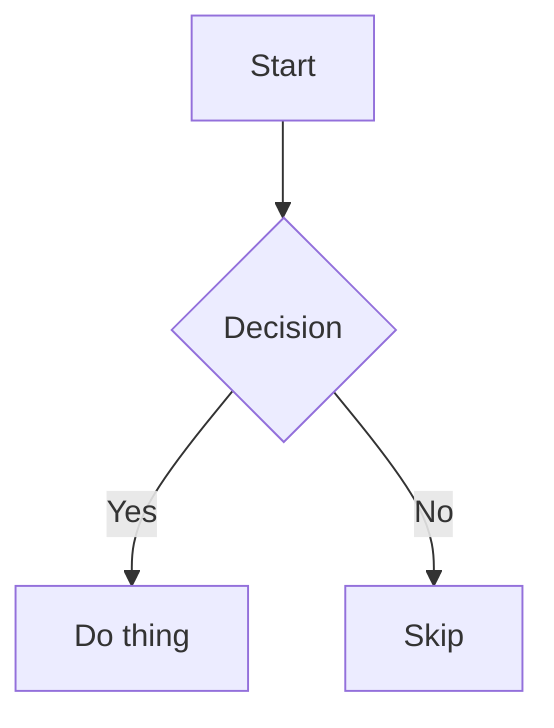
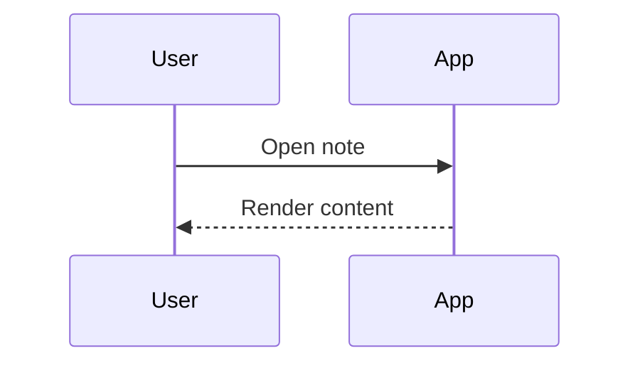

# Markdown Feature Test — Code, Diagrams & Math

Reference document exercising fenced code blocks, the Mermaid diagram node, the chemistry (SMILES) node, and KaTeX math. See `markdown-text-and-lists.md` and `markdown-tables-and-media.md` for the rest.

## Code blocks

Each fenced block below uses a language id from the editor's language picker.

```typescript
function greet(name: string): string {
  return `Hello, ${name}!`
}
```

```javascript
const sum = (a, b) => a + b
```

```python
def greet(name: str) -> str:
    return f"Hello, {name}!"
```

```rust
fn main() {
    println!("Hello, world!");
}
```

```go
func main() {
	fmt.Println("Hello, world!")
}
```

```c
#include <stdio.h>
int main() { printf("Hello, world!\n"); return 0; }
```

```cpp
#include <iostream>
int main() { std::cout << "Hello, world!"; }
```

```csharp
Console.WriteLine("Hello, world!");
```

```java
class Main {
  public static void main(String[] args) {
    System.out.println("Hello, world!");
  }
}
```

```bash
#!/usr/bin/env bash
echo "Hello, world!"
```

```shell
echo "Hello, world!"
```

```sql
SELECT id, name FROM users WHERE active = true;
```

```json
{
  "name": "nemos",
  "version": "1.1.0"
}
```

```yaml
name: nemos
version: 1.1.0
```

```xml
<note>
  <to>Reader</to>
  <body>Hello, world!</body>
</note>
```

```css
.example {
  color: var(--accent);
}
```

```http
GET /api/notes HTTP/1.1
Host: localhost
```

```ini
[section]
key = value
```

```markdown
# A heading inside a code block
```

```text
Plain, unhighlighted text block.
```

## Mermaid diagrams

Flowchart:



Sequence diagram:



## Chemistry (SMILES) structures

Ethanol:

```smiles
CCO
```

Benzene:

```smiles
c1ccccc1
```

Aspirin:

```smiles
CC(=O)OC1=CC=CC=C1C(=O)O
```

## Math

Inline math: the mass-energy equivalence $E = mc^2$ is a classic example, as is the golden ratio $\varphi = \frac{1+\sqrt{5}}{2}$.

Display math:

$$
\int_0^\infty e^{-x^2}\,dx = \frac{\sqrt{\pi}}{2}
$$

$$
\sum_{n=1}^{\infty} \frac{1}{n^2} = \frac{\pi^2}{6}
$$

## Known gaps

Features intentionally **not** supported by the editor, so they won't render specially even though they may appear in other markdown flavors: footnotes, `==highlighted text==` marks, and embeds (e.g. iframes/YouTube).
